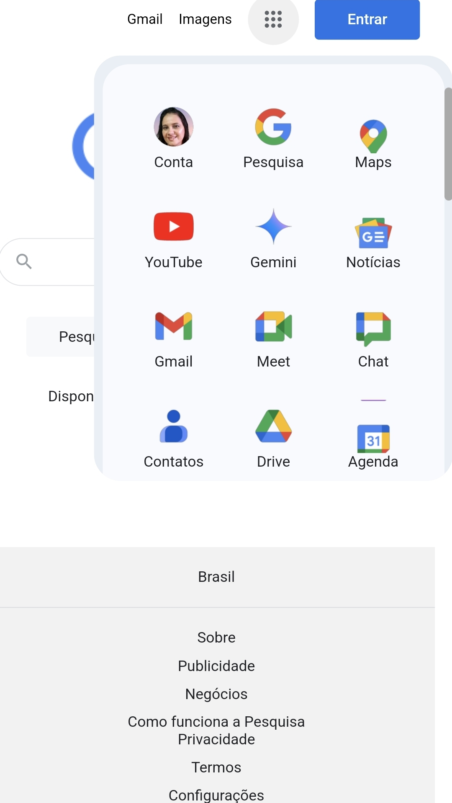

# Réplica da Página do Google

Este projeto é uma réplica funcional e responsiva da página inicial do Google, desenvolvida com o objetivo de demonstrar habilidades em desenvolvimento front-end, incluindo HTML, CSS e JavaScript. A interface foi cuidadosamente projetada para replicar o design e a experiência do usuário da página original, com foco em detalhes visuais, interatividade e boas práticas de código.

---

## 🛠️ Tecnologias Utilizadas

- **HTML5**: Estruturação semântica e acessível do conteúdo.
- **CSS3**: Estilização avançada, incluindo flexbox, grid, animações e design responsivo.
- **JavaScript**: Lógica para interatividade, como a abertura/fechamento do menu de produtos Google.
- **SVG**: Ícones vetoriais escaláveis para uma experiência visual nítida em qualquer resolução.
- **Google Fonts**: Utilização de fontes padrão do Google para manter a fidelidade ao design original.

---

## 🎯 Funcionalidades Principais

1. **Barra de Pesquisa Interativa**:
   - Campo de pesquisa funcional com ícones de teclado, microfone e câmera.
   - Efeitos de hover e focus para melhorar a experiência do usuário.

2. **Menu de Produtos Google**:
   - Popover dinâmico que exibe uma lista completa de produtos e serviços do Google.
   - Interação suave com JavaScript para abrir/fechar o menu.

3. **Botões de Ação**:
   - Botões "Pesquisa Google" e "Sinto-me com sorte" com estilização fiel ao original.
   - Efeitos de hover e transições CSS para feedback visual.

4. **Footer Dinâmico**:
   - Links para informações sobre o Google, publicidade, negócios, privacidade e termos.
   - Design responsivo que se adapta a diferentes tamanhos de tela.

5. **Design Responsivo**:
   - Layout adaptável para desktop, tablets e dispositivos móveis.
   - Uso de media queries e unidades relativas para garantir a consistência visual.

---

## 📂 Estrutura do Projeto

```
replica-google/
│
├── index.html          # Página principal com a estrutura HTML
├── style.css           # Arquivo de estilos CSS
├── scripts.js          # Lógica JavaScript para interatividade
├── README.md           # Documentação do projeto
└── assets/             # Pasta para recursos adicionais
    ├── icons/          # Ícones SVG utilizados no projeto
    └── screenshots/    # Capturas de tela do projeto
```

---

## 🚀 Como Executar o Projeto

1. **Clone o repositório**:
   ```bash
   git clone https://github.com/seu-usuario/replica-google.git
   ```

2. **Navegue até o diretório do projeto**:
   ```bash
   cd replica-google
   ```

3. **Abra o arquivo `index.html`** no seu navegador preferido.

---


| Desktop View | Mobile View |
|--------------|-------------|
|  |  |

---

## 📝 Boas Práticas Implementadas

- **Semântica HTML**: Uso de tags semânticas como `<header>`, `<main>`, `<footer>`, e `<section>` para melhorar a acessibilidade e SEO.
- **CSS Modular**: Organização do CSS em seções claras e reutilizáveis.
- **JavaScript Limpo**: Código JavaScript modular e bem comentado para fácil manutenção.
- **Design Responsivo**: Uso de media queries e unidades relativas (%, em, rem) para garantir compatibilidade com diferentes dispositivos.
- **Performance**: Uso de SVGs e otimização de imagens para carregamento rápido.

---

## 🤝 Como Contribuir

Contribuições são bem-vindas! Siga os passos abaixo para contribuir:

1. **Faça um fork** do projeto.
2. **Crie uma branch** para sua feature ou correção:
   ```bash
   git checkout -b feature/NovaFeature
   ```
3. **Commit suas mudanças**:
   ```bash
   git commit -m 'Adicionando nova feature'
   ```
4. **Push para a branch**:
   ```bash
   git push origin feature/NovaFeature
   ```
5. **Abra um Pull Request** no repositório original.

---

## 📜 Licença

Este projeto está licenciado sob a licença MIT. Consulte o arquivo [LICENSE](LICENSE) para mais detalhes.

---

## 🙌 Agradecimentos

- Canal Hashtag Programação.
- Inspirado no design e funcionalidades do Google.
- Comunidade de desenvolvedores por compartilhar conhecimento e recursos.
- Ferramentas como [Google Fonts](https://fonts.google.com/) e [SVG Repo](https://www.svgrepo.com/) por fornecer recursos gratuitos.

---

## 📞 Contato

Se você tiver alguma dúvida ou sugestão, sinta-se à vontade para entrar em contato:

- **Nome**: Juliana de Maula
- **E-mail**: jdemaula@gmail.com
- **LinkedIn**: [Seu Perfil no LinkedIn]
- **GitHub**: [Seu Perfil no GitHub]

